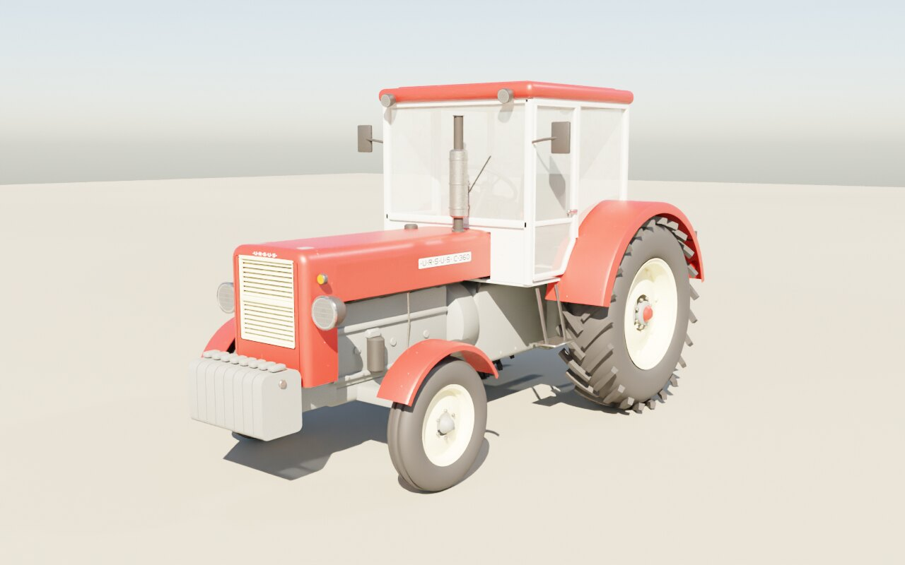
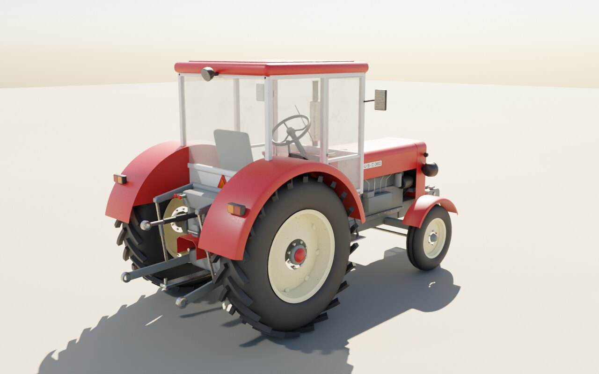
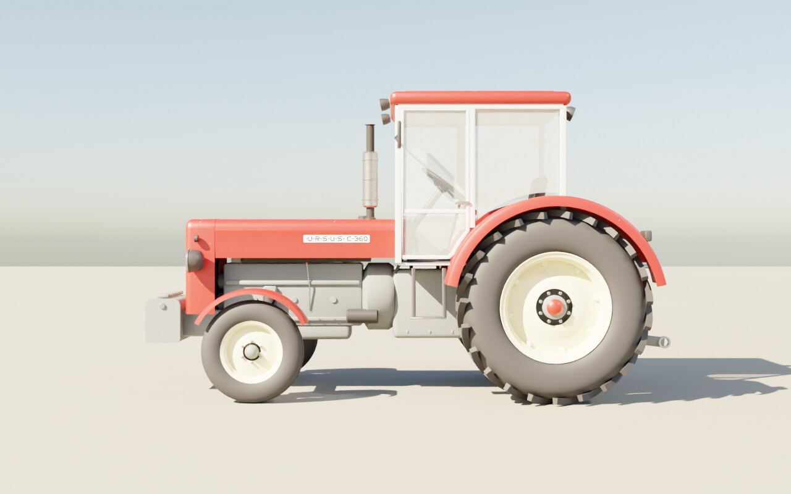
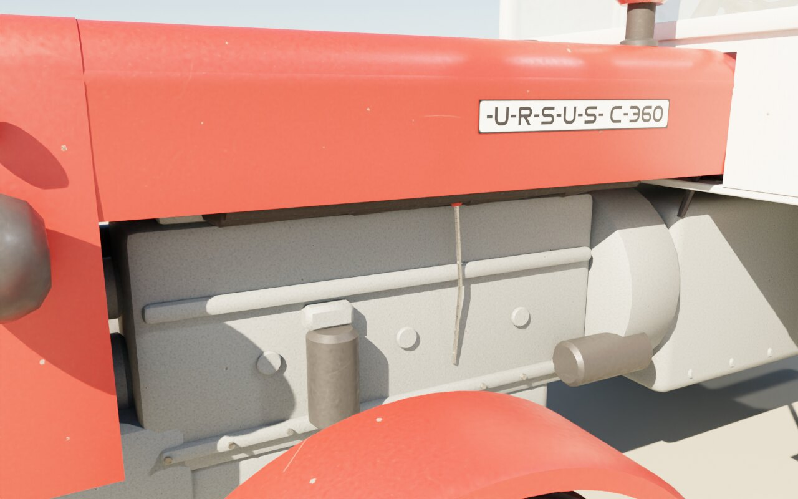
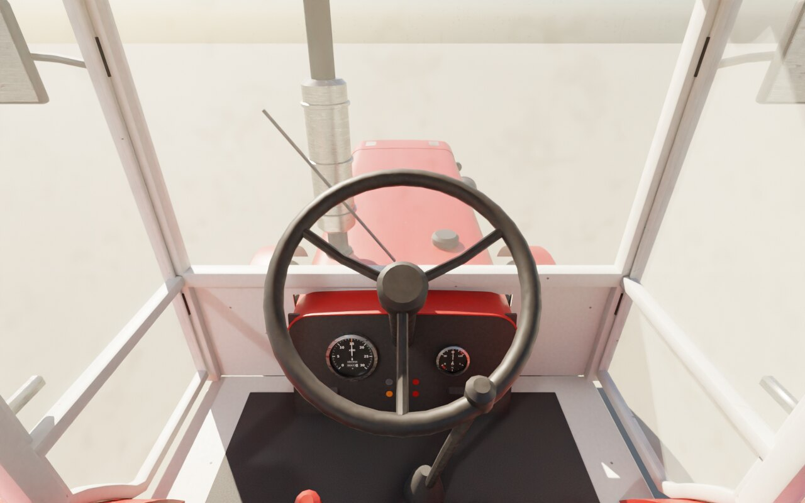

# Ursus C-360 – mod do Farming Simulator 25

Kultowa „sześćdziesiątka” (1976–1994) jako gotowy mod FS25: jeździ, skręca, ma skrzynię 10/2 z reduktorem,
TUZ kat. II, WOM 540, zaczep górny i wahliwy, światła, kierunkowskazy, zegary i dźwięk silnika S-4003.
Model, tekstury i dźwięki są w całości generowane z kodu w tym repozytorium (Blender 4.5 sterowany przez MCP).



## Instalacja

1. Pobierz [`dist/FS25_UrsusC360.zip`](dist/FS25_UrsusC360.zip) – nie rozpakowuj.
2. Wrzuć plik do `Dokumenty/My Games/FarmingSimulator2025/mods/`.
3. W grze: Sklep → Ciągniki (małe) → marka **Ursus**, cena 28 000.

## Co jest w środku

- **Model** (ok. 68 tys. trójkątów, 27 kształtów) według zdjęć referencyjnych z Wikimedia Commons: maska z tabliczką
  „-U-R-S-U-S- C-360”, kremowa żaluzja atrapy, reflektory w czarnych obudowach, blok S-4003 z pompą wtryskową P24,
  przewodami wtryskowymi, filtrami, rozrusznikiem i paskiem, jasnoszara kabina z czerwonym dachem, lusterkami,
  lampami roboczymi i trójkątem pojazdu wolnobieżnego, opony 14.9-28 z bieżnikiem „jodełka” i 6.00-16 trzyżeberkowe,
  kremowe felgi, obciążniki, kompletny TUZ (cięgła, wieszaki, łącznik górny), osłona WOM, wnętrze z zegarami.
- **Dane fabryczne:** rozstaw osi 2125 mm, rozstaw kół 1450 mm, wysokość z kabiną ok. 2230 mm, masa 2170 kg (sucha),
  S-4003: 52 KM przy 2200 obr/min, 190 Nm przy 1500–1600 obr/min, bieg jałowy 700 obr/min, prędkość maks. 25,4 km/h,
  zbiornik 70 l, napęd na tył, WOM 540.
- **Dźwięk** (`FS25_UrsusC360/sounds/`): rozruch (rozrusznik 12 V, łapanie zapłonu, przegazowanie, opadanie na jałowe),
  gaszenie, 8 pętli silnika miksowanych przez grę według obrotów i obciążenia (jałowe, bez obciążenia 1200/1700/2300,
  pod obciążeniem 1000/1500/2000/2200), wycie skrzyni zależne od prędkości, zmiana biegu, zgrzyt, pompa hydrauliki
  i klakson. Posłuchaj: [`docs/sound_demo.ogg`](docs/sound_demo.ogg) (start → jałowe → gaz → ruszanie z obciążeniem →
  jazda → zgaszenie).
- **Funkcje:** 5 biegów × reduktor L/H + 2 wsteczne, obrotomierz i wskaźnik paliwa, obracająca się kierownica, klapka
  wydechu, dym z wydechu, tankowanie na stacjach, postać kierowcy, kamery zewnętrzna i z kabiny.

| | |
|---|---|
|  |  |
|  |  |

## Weryfikacja

- `ursusC360.xml` i `modDesc.xml` przechodzą walidację oficjalnymi schematami GIANTS FS25 (`vehicle.xsd`,
  `modDesc.xsd`); `descVersion 94` mieści się w zakresie 90–111 obecnego patcha.
- `tools/validate_mod.py`: każde odwołanie do węzła istnieje w i3d, pliki istnieją, typy modyfikatorów dźwięku są
  typami FS25, geometria TUZ i filtry kolizji zgadzają się z plikami gry bazowej – 0 błędów, 0 ostrzeżeń.
- `ursusC360.i3d.shapes` jest w formacie v10 (FS25). Koder odtwarza bajt w bajt 118 prawdziwych plików FS25 po
  ponownym zakodowaniu, a nasz plik przechodzi test round-trip (`tools/i3d/verify_shapes.py`).
- **Nie** był uruchamiany w samej grze ani w GIANTS Editor (środowisko budowania nie ma FS25). Jeśli coś nie działa,
  wklej fragment `log.txt` z folderu gry.

## Ograniczenia

- Dźwięki są syntetyzowane z modelu fizycznego silnika (kolejność zapłonu 1-3-4-2, stuk diesla, rezonans rury
  wydechowej), bo nie ma nagrań C-360 na wolnej licencji. Własne nagrania możesz podmienić w `sounds/`, zachowując
  nazwy plików.
- Materiały nie używają `vehicleShader`, więc nie ma dynamicznego brudu/zużycia ani zmiany koloru lakieru.
- Oś przednia nie jest animowana wahliwie, brak osobnych świateł drogowych.
- Strojenie zawieszenia opon, hamulców i głośności jest wyliczone, nie dopracowane w grze.

## Budowanie ze źródeł

Wymagania: Blender 4.5, Python 3 z `numpy`, `Pillow`, `lxml`, `ffmpeg`.

```bash
tools/build.sh             # tekstury, dźwięki, model (Blender headless), rendery, binaryzacja, walidacja, zip
USE_MCP=1 tools/build.sh   # model budowany przez serwer blender-mcp
```

Blender przez MCP: `xvfb-run blender --python tools/mcp/start_blender_mcp.py` uruchamia dodatek
[blender-mcp](https://github.com/ahujasid/blender-mcp), a `tools/mcp/blender_mcp_run.py --script blender/build_all.py`
wykonuje budowę modelu narzędziem `execute_blender_code`.

| Katalog | Zawartość |
|---|---|
| `blender/` | proceduralny model, eksporter i3d, rendery |
| `tools/sound/` | syntezator dźwięków S-4003 |
| `tools/textures/` | generator tekstur PBR i koder DDS (BC1/BC3) |
| `tools/i3d/` | konwersja geometrii i3d do binarnego `.i3d.shapes` (v10) |
| `tools/validate_mod.py` | walidacja moda (XSD FS25, węzły, pliki, fizyka) |
| `docs/` | kontrakt węzłów i3d, notatki XML ze źródłami, rendery, demo dźwięku |

## Licencje

Pliki w `tools/i3d/` są na licencji GPL-3.0-or-later, a tabela kluczy na MIT – szczegóły w
[`tools/i3d/LICENSE-NOTICE.md`](tools/i3d/LICENSE-NOTICE.md). Ursus to znak towarowy jego właściciela; mod jest
fanowskim, niekomercyjnym odwzorowaniem.
